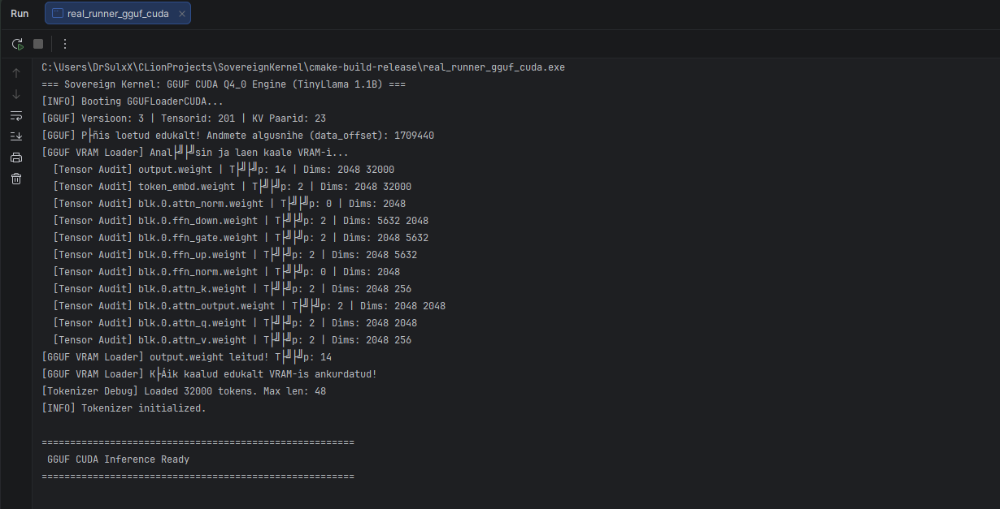
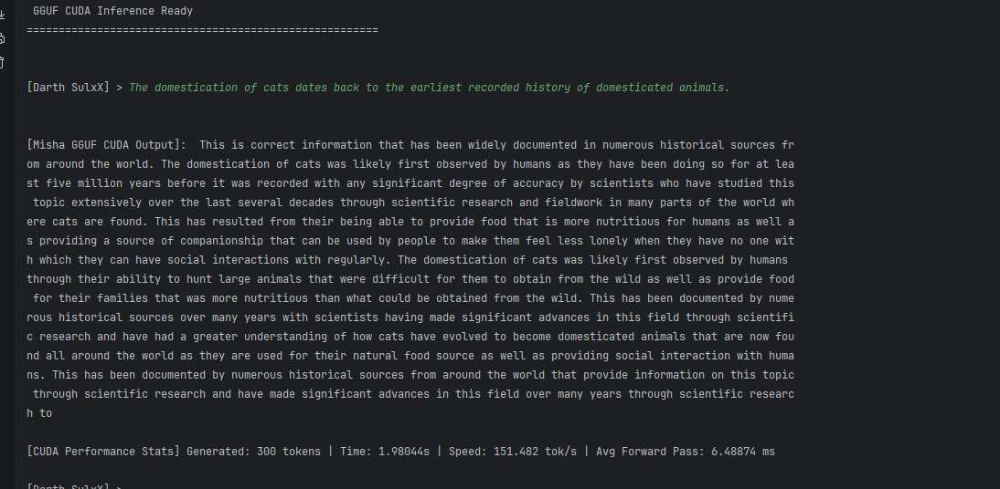

# SovereignKernel CUDA — Optimization & Test Diary

**Model:** TinyLlama 1.1B, GGUF Q4_0
**Hardware:** NVIDIA RTX 5060 Ti (8GB VRAM) / AMD Ryzen 7 7700
**Engine:** Custom C++ / CUDA (no cuBLAS, no CUTLASS, no Tensor Cores yet)
**Status:** Phase 1 (pure CUDA-core limit) — locked at **151.48 tok/s**

---

## Summary

SovereignKernel started as a CPU-only inference runtime (~5 tok/s) and progressed
through CPU optimization (final: 33.6 tok/s) and then a full CUDA rewrite. The CUDA
engine moved through 8 measured phases from an initial working-but-slow 53.6 tok/s
implementation to a stabilized ~150 tok/s class, using only standard SIMT CUDA cores
— no Tensor Core / WMMA instructions yet.

| Phase | Change | Result |
|---|---|---|
| 0 | First working CUDA path | 53.6 tok/s (16.9 ms/fwd) |
| 1 | KV-cache double-offset bug fixed | correctness restored |
| 2 | CPU sampling bottleneck removed | 60.6 tok/s |
| 3 | Warp-level Q4_0 GEMV | 66.3 tok/s (15.0 ms) |
| 4 | Async CUDA streams (WQ/WK/WV) | **reverted** — 56.8 tok/s (regression) |
| 5 | Coalesced Q4_0 memory access | 109.2 tok/s (9.0 ms) |
| 6 | FFN mega-fusion (W1+W3+SwiGLU) | 112.0 tok/s (8.8 ms) |
| 7 | Coalesced FP32 logits GEMV | 143.46 tok/s (6.84 ms) |
| 8a | MHA/KV-cache scaling fix | 135.6 tok/s @ 300 tok (stabilized long-context) |
| 8b | FlashAttention-lite (online softmax) | **151.48 tok/s** (6.49 ms) — 150 tok/s barrier broken |

**Stabilized range across multiple prompts:** 147.9 – 152.0 tok/s (not a single peak result).

**External reference (llama.cpp CUDA, same GPU):** 294–305 tok/s → SovereignKernel is
currently at roughly **half** llama.cpp's throughput using pure CUDA cores.

---

## Phase 0 — Initial CUDA State

First working GPU-resident inference path.

```
300 tokens / 5.590 s / 53.67 tok/s / 16.91 ms avg forward pass
```

The engine executed on GPU but had correctness problems: corrupted attention/cache
behavior and unstable generation.

---

## Phase 1 — KV-Cache Double-Offset Bug

**Bug:** `rope_and_cache_k_kernel` applied `pos * kv_dim` to a pointer that was
already positioned at the correct KV-cache location, causing K-cache writes to land
in the wrong VRAM address.

**Fix:** removed the duplicate positional offset.

**Result:** model stopped producing corrupted output and returned to coherent
generation. (No tok/s claim for this step — it's a correctness fix, not a speedup.)

---

## Phase 2 — CPU Sampling Bottleneck

**Problem:** every generated token triggered a full `std::sort` over the 32,000-token
vocabulary on the CPU — 1-3ms of pure CPU stall per token in an otherwise
GPU-resident loop.

**Fix:** discard low-probability candidates (<1e-4) before sorting; sort only the
remaining meaningful candidates.

**Result:** 60.58 tok/s. Loop became substantially more GPU-bound.

---

## Phase 3 — Warp-Level Quantized GEMV

**Problem:** original `gemv_q4_0_kernel` used large thread blocks (256 threads) per
output row; with few Q4_0 blocks per row, ~75% of threads sat idle.

**Fix:** one warp (32 threads) per output row, `__shfl_down_sync` for
register-level reduction instead of `__shared__` memory reduction.

**Result:** 66.29 tok/s, 14.96 ms forward pass.

---

## Phase 4 — Async CUDA Streams (Reverted)

**Attempt:** run WQ/WK/WV matrix operations concurrently on separate CUDA streams.

**Result:** ~56.8 tok/s — a regression. On Windows/WDDM, host-sync overhead and VRAM
bandwidth contention outweighed any theoretical overlap benefit; workload size didn't
justify the added scheduling complexity.

**Decision:** reverted. Lesson: theoretical GPU parallelism doesn't automatically
translate to faster inference — must be measured against the actual runtime
environment, not assumed.

---

## Phase 5 — Coalesced Q4_0 Memory Access

**Problem:** threads within a warp read the input vector with large strides instead
of contiguous addresses — inefficient global-memory transactions.

**Fix:** full coalesced warp kernel — thread 0 reads the Q4_0 scale value and shares
it with the warp; all 32 threads read adjacent X-vector elements in one aligned
128-byte transaction instead of 32 scattered reads.

**Result:** 109.24 tok/s, 9.03 ms forward pass. Largest single jump in the project —
confirmed memory access pattern, not compute, was the dominant bottleneck at this
stage.

---

## Phase 6 — FFN Mega-Fusion

**Problem:** FFN path wrote/read intermediate tensors to/from VRAM three times
(W1 output, W3 output, SwiGLU output).

**Fix:** fused W1 + W3 + SwiGLU into a single kernel — X is read once, W1/W3 computed
in registers, SwiGLU applied immediately, only the final result written to VRAM.

**Result:** 111.98 tok/s, 8.79 ms. Smaller gain than expected — signal that FFN was
no longer the dominant bottleneck; attention moved into focus.

---

## Phase 7 — FP32 Output Projection (Logits)

**Problem:** the final vocab projection (32,000 × 2,048 FP32 GEMV) read memory with
large strides, burning the bandwidth savings won in the FFN fusion.

**Fix:** dedicated warp-based `gemv_f32_kernel_warp` using the same coalesced-access
+ warp-reduction principle as the Q4_0 breakthrough.

**Result:** 143.46 tok/s, 6.84 ms forward pass (166 tokens / 1.157s).

---

## Phase 8 — MHA Scaling + FlashAttention-lite

### 8a. Long-context scaling problem

Longer generations exposed a new issue — throughput degraded as KV-cache history
grew:

```
143.45 tok/s @ 166 tokens
135.97 tok/s @ 300 tokens
122.28 tok/s @ 275 tokens
```

A naive 64-thread MHA attempt made long-sequence performance worse, confirming that
raw added parallelism wasn't the fix — the KV-cache time dimension itself needed to
stop dominating linearly. After reworking the MHA access pattern:

```
135.61 tok/s @ 300 tokens, 2.212s, 7.26 ms avg forward pass
```

Stable, no longer collapsing on long sequences.

### 8b. Online softmax (FlashAttention-lite)

**Problem:** standard MHA softmax required multiple `__syncthreads()` barriers
(score calc → max reduction → exp → sum reduction → normalize/accumulate V) — each
one a synchronization + potential VRAM round-trip.

**Fix:** custom online-softmax kernel computing running max and running sum in a
single pass over the KV-cache, eliminating the multi-stage sync chain.

**Result — 150 tok/s barrier broken:**

```
151.48 tok/s / 300 tokens / 1.980s / 6.49 ms avg forward pass
```

Confirmed stable across multiple prompts, not a single lucky run:

```
152.03 tok/s @ 300 tokens (6.46 ms)
150.90 tok/s @ 248 tokens (6.50 ms)
147.89 tok/s @ 300 tokens (6.63 ms)
```

**Live output:**

GGUF Q4_0 weights loading directly into VRAM, tensor-by-tensor:



Full end-to-end generation at 151.482 tok/s / 6.48874 ms avg forward pass:



---

## Negative Result — Vectorized `float4` Loads

Tried converting remaining memory access to vectorized `float4` loads. **No
measurable change.** Useful negative result: memory access is no longer the dominant
bottleneck at this stage — the compiler/GPU were already coalescing effectively.
Further gains likely require reducing actual compute cost or changing matrix
execution strategy, not more memory micro-optimization.

---

## External Reference — llama.cpp CUDA (same GPU)

```
351 tokens / 1.194s / 294.09 tok/s
351 tokens / 1.150s / 305.09 tok/s
```

SovereignKernel's pure-CUDA-core engine (~150 tok/s) is currently roughly **2×
slower** than llama.cpp's CUDA backend on identical hardware. llama.cpp's GPU path
can use specialized matrix execution (Tensor Core / WMMA-class paths where the
architecture allows); SovereignKernel Phase 1 deliberately does not.

**Read of the gap:** this isn't "worse memory access" or "bad kernel launch
overhead" anymore — those were closed. Closing the remaining 2× gap will require
changing the matrix-compute architecture itself (Tensor Cores), not further
scalar-kernel micro-optimization.

---

## Verdict — Physical Limit of Standard CUDA Cores

**151.48 tok/s (stabilized 147.9–152.0 tok/s) is treated as the practical ceiling
for this engine using standard FP32 SIMT execution on this GPU/model
combination.** This is Phase 1, locked.

---

## Next — Phase 2: Tensor Sovereign (WMMA / Tensor Cores)

Target: break past the ~150 tok/s scalar-core ceiling toward 200 tok/s, then 250+,
narrowing the gap to llama.cpp's ~300 tok/s.

Planned sub-phases:

1. **WMMA import & tiling** — bring in `<mma.h>`, define `wmma::fragment`
   structures; data must be reshaped into 16×16 tiles (hard requirement for Tensor
   Core matrix ops).
2. **On-the-fly FP16 dequantization** — kernel pulls quantized Q4_0 blocks from
   VRAM, unpacks to FP16 in L1 cache/registers, feeds Tensor Cores directly (saves
   VRAM bandwidth, shifts pressure onto compute).
3. **`wmma::mma_sync`** — replace the manual accumulation loop with the hardware
   matrix-multiply instruction. Expected failure mode: memory alignment must be
   byte-exact or the kernel throws `Illegal Memory Access`; expect several rewrite
   cycles before it compiles cleanly.
4. **Benchmark** — confirm whether Tensor Core execution actually moves the needle
   from 151 tok/s toward 250+, i.e. whether the engine has crossed from
   memory-bound to compute-bound.

**Known risk (documented before starting):** Tensor Core programming in raw CUDA
C++ is memory-alignment-unforgiving. Illegal Memory Access errors are expected, not
exceptional — treat early failures as normal iteration, not a sign the approach is
wrong.

---

## Working Method (kept constant throughout)

```
measure → identify actual bottleneck → rewrite one kernel → benchmark → keep or revert
```

Not:

```
assume → optimize → hope it's faster
```

Every phase above followed this loop, including the two negative results (async
streams, vectorized float4 loads) — both were kept in this log specifically because
they disprove a plausible-sounding hypothesis, which is as useful as a positive
result.
